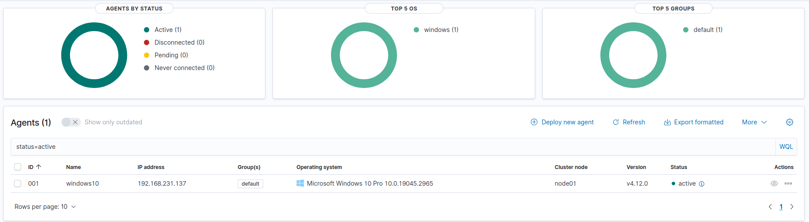
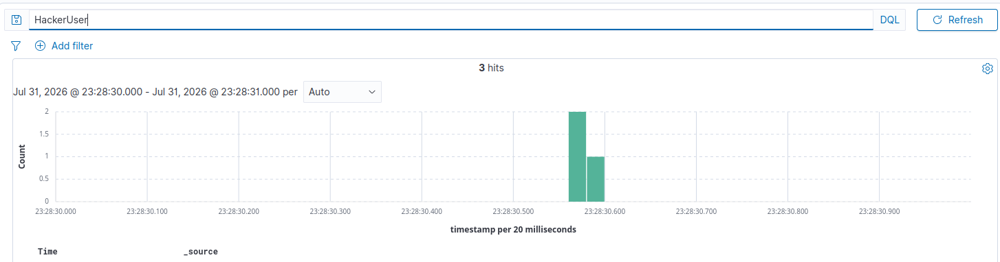
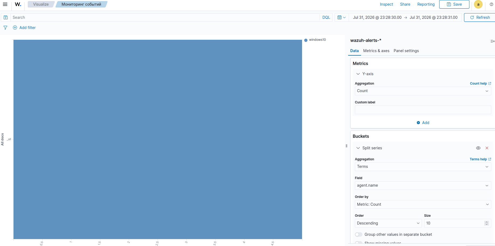

# Проект 2: Развертывание SIEM (Wazuh) и сбор логов с Windows

**Аналитик:** Сергей  
**Дата:** 1 августа 2026 г.  
**Статус:** Завершено  

---

## Цель проекта

Развернуть бесплатный SIEM-комплекс Wazuh, настроить сбор и анализ логов с виртуальной машины Windows 10 pro.  

---

## Среда выполнения

| Компонент | Характеристика |
|-----------|----------------|
| **SIEM-платформа** | Wazuh 4.12.0 (развернут через Docker на Ubuntu 26.04) |
| ** ОС для атаки** | Windows 10 Pro  |
| **Тип развертывания** | All-in-One  |
| **Сеть** | Nat  |

---

## Процесс развертывания

### 1. Установка Wazuh

Из-за использования Ubuntu 26.04, установка Wazuh невозможно по причине неподходящей версии ОС Linux. Решил использовать **Docker-развертывание** как наиболее стабильный способ для современных версий Linux.  

**Ключевые шаги:**
*   Установка Docker и Docker Compose.
*   Клонирование репозитория `wazuh-docker`.
*   Генерация SSL-сертификатов.
*   Запуск всех трех компонентов (Indexer, Manager, Dashboard) через `docker-compose up -d`.

### 2. Установка и настройка агента на Windows

Был установлен агент Wazuh. И запущен процесс NET START WazuhSvc.

### 3. Генерация тестовых событий

Для проверки работы SIEM на Windows-машине было выполнено:
1.  Создание нового пользователя через командную строку: `net user HackerUser P@ssw0rd123! /add`.
2.  Несколько неудачных попыток входа в систему с неверным паролем.

---

## 🔍 Анализ событий и работа с интерфейсом

### Раздел "Discover"
В разделе Discover были успешно найдены все созданные события.
*   **Поиск по имени пользователя:** Запрос `HackerUser` показал событие создания учетной записи (Event ID 4720).  

### Создание дашборда
Для наглядного мониторинга был создан базовый дашборд.
*   **Визуализация:** Горизонтальная гистограмма.
*   **Группировка:** По полю `agent.name`.
*   **Цель:** Отображение количества событий, поступающих от каждого активного агента.

---

## Скриншоты

*Рис. 1: Статус агента в интерфейсе Wazuh (Endpoints)*  

*Рис. 2: Поиск события создания пользователя HackerUser в Discover*  

*Рис. 3: Пример созданного дашборда с мониторингом агентов*  

---

## Заключение

В ходе проекта решил следующие задачи:
1.  Успешно развернуть SIEM на основе Wazuh на Docker в Ubuntu 26.04.
2.  Настроить сбор логов с виртуальной машины  Windows 10 pro.
3.  Научиться эффективно использовать поиск и визуализацию для анализа событий безопасности.
4.  Преодолеть типичные трудности, связанные с сетевыми настройками, правами доступа и конфигурацией агентов.

---

## 🔄 Следующие шаги

- [ ] Изучить и настроить правила корреляции в Wazuh.
- [ ] Подключить к Wazuh второй агент (Linux) для сбора логов.
- [ ] Настроить отправку уведомлений (Email/Telegram) о критических событиях.
- [ ] Создать дашборд для мониторинга атак по техникам MITRE ATT&CK.
